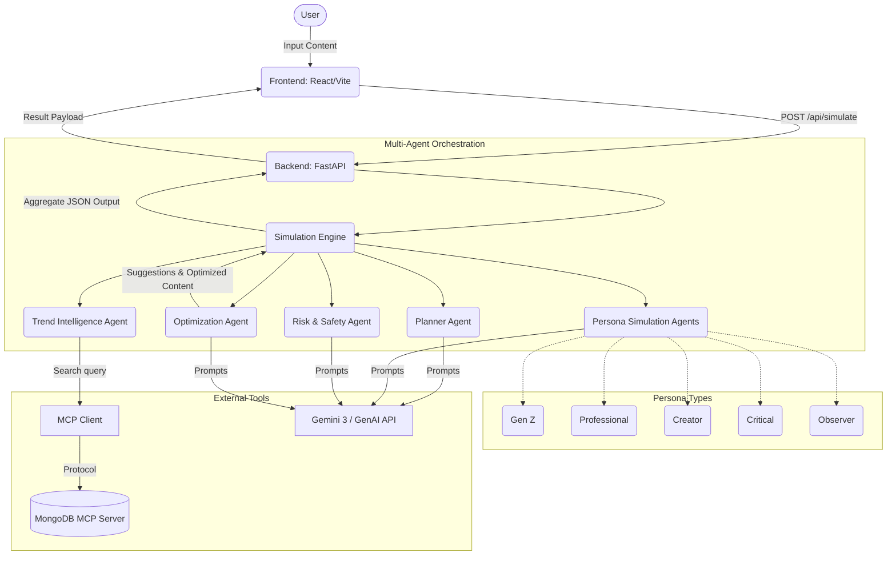

# Architecture Diagram

```mermaid
graph TD
    User([User]) -->|Input Content| UI(Frontend: React/Vite)
    UI -->|POST /api/simulate| API(Backend: FastAPI)
    
    subgraph Multi-Agent Orchestration
        API --> Engine(Simulation Engine)
        Engine --> Planner(Planner Agent)
        Engine --> Personas(Persona Simulation Agents)
        Engine --> Risk(Risk & Safety Agent)
        Engine --> Trends(Trend Intelligence Agent)
        Engine --> Optimizer(Optimization Agent)
    end
    
    subgraph Persona Types
        Personas -.-> GenZ(Gen Z)
        Personas -.-> Pro(Professional)
        Personas -.-> Meme(Creator)
        Personas -.-> Skeptic(Critical)
        Personas -.-> Neutral(Observer)
    end
    
    subgraph External Tools
        Trends -->|Search query| MCP[MCP Client]
        MCP -->|Protocol| MongoDB[(MongoDB MCP Server)]
        Planner & Personas & Risk & Optimizer -->|Prompts| Gemini[Gemini 3 / GenAI API]
    end
    
    Optimizer -->|Suggestions & Optimized Content| Engine
    Engine -->|Aggregate JSON Output| API
    API -->|Result Payload| UI
```
